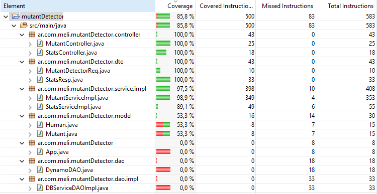

# Mutant Detector (Exámen MercadoLibre)

El ejercicio propuesto consiste en analizar una matriz de ADN en busca de mutantes. Además, se pide armar un API REST que nos permitirá invocar esa funcionalidad.
También se solicita sumar una base de datos en la cual ir almacenando los ADN analizados (sin generar duplicados) para luego poder consultar un servicio (también como API) de estadísticas y poder obtener la cantidad de ADNs mutantes y humanos analizados y la ratio de mutantes / humanos registrados.

Para más detalles ver el enunciado que se encuentra dentro de /resources/docs/.

## Uso de la API:

### Analizador de ADN:

Request POST a http://mutantesmeli.us-east-2.elasticbeanstalk.com:8080/mutant 

En el body se debe enviar la cadena de ADN a analizar.
Ejemplo:

{
"dna":["ATGCGA","CAGTGC","TTATGT","AGAAGG","CCCCTA","TCACTG"]
}

*Las letras del ADN solo pueden ser: A,T,C y/o G, las cuales representan cada base nitrogenada del ADN.

En caso de verificar un mutante, devolverá un HTTP 200-OK, en caso contrario un 403-Forbidden.

### Estadísticas:

Request GET a http://mutantesmeli.us-east-2.elasticbeanstalk.com:8080/stats

Se devolverá un JSON con la cantidad de ADNs mutantes y humanos analizados y la ratio de mutantes / humanos registrados.
Ejemplo:

{"count_mutant_dna":40,"count_human_dna":100,"ratio":0.4}

## Tecnologías usadas:

* El proyecto fue desarrollado en [Java 1.8](https://www.java.com/).
* [Maven](https://maven.apache.org/) se utilizó para la gestión de dependencias y para el build.
* [Spring Boot](https://spring.io/projects/spring-boot) fue utilizado para el armado de la API Rest.
* La base de datos es una [DynamoDB Cloud](https://docs.aws.amazon.com/dynamodb/index.html) que se integra desde AWS. Es una base de datos noSQL. Elegí este tipo de base de datos por su sencillez y velocidad de respuesta, y DynamoDB en particular por su fácil integración con AWS.

## Tests:

Los tests automáticos se hicieron con [jUnit](https://junit.org) y [Mockito](https://site.mockito.org/) a través de Spring Boot.
El code coverage dio 85.8%, y se puede ver en la siguiente imagen de evidencia:

Para soportar una alta cantidad de peticiones, las instancias de App y DB fueron configuradas para crecer acorde a la demanda. Las pruebas de carga fueron hechas con la suite de SoapUI, obteniendo resultados exitosos.

